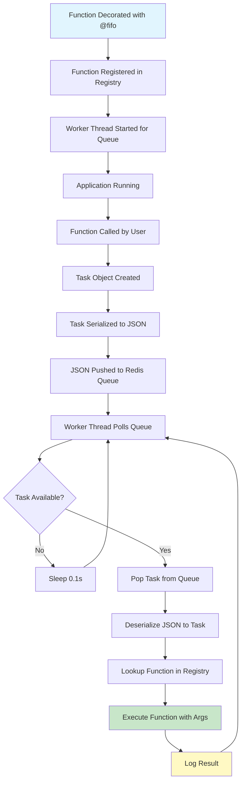
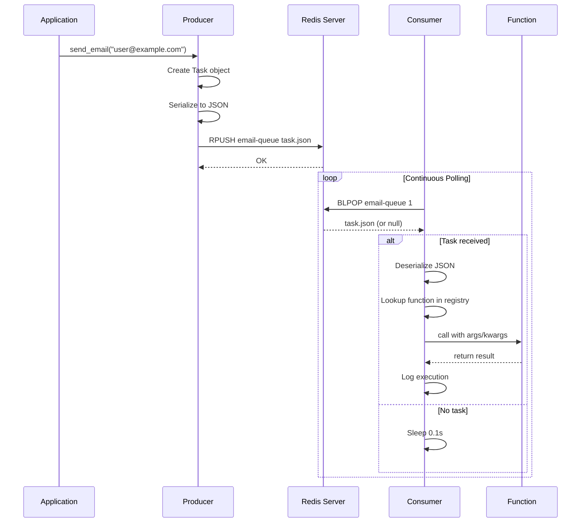
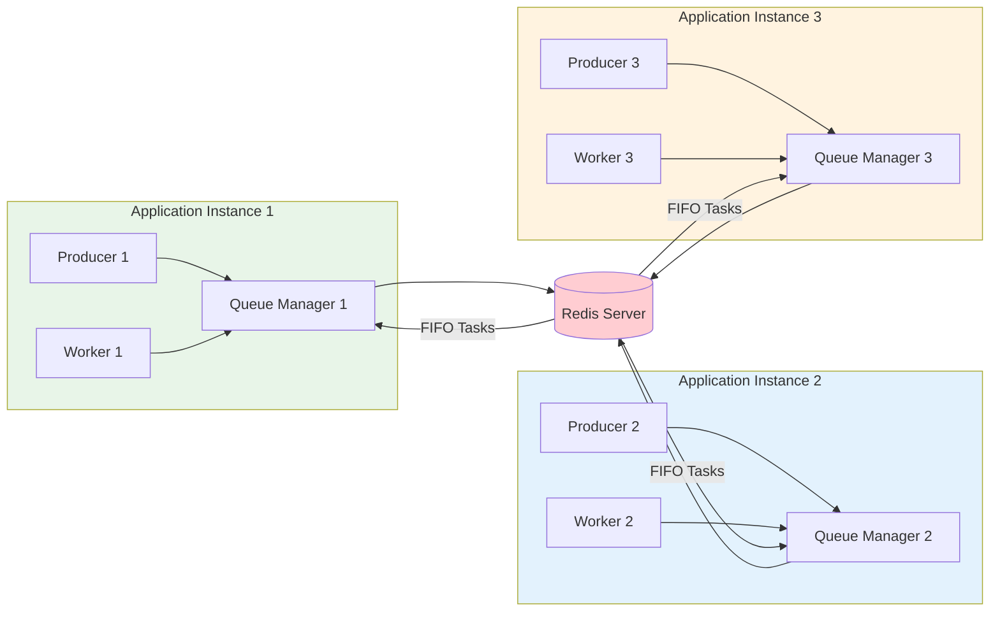

# RedisQ Architecture & Design 🏗️

This document explains the internal architecture, design decisions, and workflow of RedisQ.

## 📋 Table of Contents

1. [Overview](#-overview)
2. [Core Components](#-core-components)
3. [System Architecture](#-system-architecture)
4. [Data Flow](#-data-flow)
5. [Workflow Diagrams](#-workflow-diagrams)
6. [Design Decisions](#-design-decisions)
7. [Performance Characteristics](#-performance-characteristics)
8. [Scalability Patterns](#-scalability-patterns)

---

## 🎯 Overview

RedisQ is a **minimal, Redis-backed FIFO task queue** designed for simplicity and reliability. It follows a **producer-consumer pattern** with embedded workers that run as daemon threads within your application.

### Key Architectural Principles

- **🏠 Embedded Workers**: No separate processes - workers run inside your app
- **🔄 FIFO Guarantee**: Tasks execute in exact order within each queue
- **📦 Zero Configuration**: Works out-of-the-box with sensible defaults
- **🔀 Multi-Queue**: Different queues for different task types
- **🧵 Thread-Safe**: Built for concurrent applications

---

## 🧩 Core Components

### Component Overview

```
┌─────────────────┐    ┌─────────────────┐    ┌─────────────────┐
│    Producer     │    │     Manager     │    │    Consumer     │
│   @fifo()       │───▶│   Registry      │◀───│   Workers       │
│   Decorator     │    │   Backend       │    │   Threads       │
└─────────────────┘    └─────────────────┘    └─────────────────┘
         │                       │                       │
         │                       │                       │
         ▼                       ▼                       ▼
┌─────────────────┐    ┌─────────────────┐    ┌─────────────────┐
│      Task       │    │     Redis       │    │     Output      │
│   Serialized    │    │     Backend     │    │    Results      │
│     JSON        │    │     Queues      │    │    Logging      │
└─────────────────┘    └─────────────────┘    └─────────────────┘
```

### 1. **Producer (`producer.py`)**
- **Purpose**: Converts function calls into queued tasks
- **Implementation**: `@fifo()` decorator that wraps functions
- **Responsibility**: Task creation, serialization, and enqueuing

```python
@fifo(queue="email-queue")
def send_email(recipient, subject):
    # This function becomes a task producer
    pass
```

### 2. **Manager (`manager.py`)**
- **Purpose**: Central coordination point for all components
- **Components**:
  - `QueueManager`: Global state management
  - `QueueRegistry`: Function-to-queue mappings
- **Responsibility**: Backend configuration, function registry

### 3. **Registry (`registry.py`)**
- **Purpose**: Maps function paths to queue names and function objects
- **Implementation**: Metaclass-based singleton pattern
- **Key Features**:
  - Unique function identification
  - Queue name association
  - Function object storage

### 4. **Backend (`backend.py`)**
- **Purpose**: Redis interface for queue operations
- **Operations**: 
  - `push()`: Add tasks to queue end (RPUSH)
  - `pop()`: Remove tasks from queue start (BLPOP)
- **Features**: Connection management, task serialization

### 5. **Consumer (`consumer.py`)**
- **Purpose**: Process tasks from queues
- **Implementation**: Continuous polling loop
- **Features**: Function execution, error handling, logging

### 6. **Workers (`workers/`)**
- **Purpose**: Threading implementation for concurrent processing
- **Types**:
  - `threading.py`: Thread-based workers (current)
  - `asyncio.py`: Async workers (future)

### 7. **Task (`task.py`)**
- **Purpose**: Data structure representing a queued task
- **Format**: JSON with function path, args, kwargs
- **Lifecycle**: Creation → Serialization → Queue → Deserialization → Execution

---

## 🏗️ System Architecture

### High-Level Architecture

```
┌───────────────────────────────────────────────────────────────┐
│                    Python Application                         │
│                                                               │
│       ┌─────────────┐ ┌─────────────┐ ┌─────────────┐         │
│       │   Flask     │ │   Django    │ │   FastAPI   │         │
│       │    App      │ │     App     │ │     App     │         │
│       └─────────────┘ └─────────────┘ └─────────────┘         │
│              │               │               │                │
│              └───────────────┼───────────────┘                │
│                              │                                │
│  ┌─────────────────────────────────────────────────────────┐  │
│  │                   RedisQ                                │  │
│  │                                                         │  │
│  │  @fifo ──▶ Producer ──▶ Manager ──▶ Redis ──▶ Consumer  │  │
│  │             │            │            │         │       │  │
│  │             ▼            ▼            ▼         ▼       │  │
│  │          Tasks       Registry      Queues    Workers    │  │
│  └─────────────────────────────────────────────────────────┘  │
└───────────────────────────────────────────────────────────────┘
                              │
                              ▼
                    ┌─────────────────────┐
                    │      Redis          │
                    │     Server          │
                    │                     │
                    │  queue1: [t1,t2,t3] │
                    │  queue2: [t4,t5]    │
                    │  queue3: [t6]       │
                    └─────────────────────┘
```

### Component Interaction Flow

```
Application Startup:
1. Function decoration (@fifo) registers functions
2. Registry stores function mappings
3. Worker threads start for each queue
4. Backend connects to Redis

Task Execution:
1. Function call creates Task object
2. Task serialized to JSON
3. JSON pushed to Redis queue (RPUSH)
4. Worker thread pops task (BLPOP)
5. Task deserialized and executed
6. Results logged/returned
```

---

## 🔄 Data Flow

### 1. **Task Creation Flow**

```
User Code:                    RedisQ Internals:
─────────                     ─────────────────

send_email(args)         ──▶   @fifo decorator triggered
     │                             │
     └─ Function Call              ▼
                             Task object created
                                   │
                                   ▼
                             JSON serialization
                                   │
                                   ▼
                             Redis RPUSH to queue
                                   │
                                   ▼
                             Task queued successfully
```

### 2. **Task Processing Flow**

```
Redis Queue:              Worker Thread:               Function Execution:
────────────              ──────────────               ───────────────────

queue: [task1,task2]          │                              │
     │                   BLPOP blocking pop                  │
     └─ task1 ──────────▶     │                              │
                              ▼                              │
                        JSON deserialization                 │
                              │                              │
                              ▼                              │
                        Function lookup in registry          │
                              │                              │
                              ▼                              │
                        Function call with args/kwargs ────▶ │
                                                             │
                                                         Execute
                                                             │
                                                             ▼
                                                        Return result
```

### 3. **Multi-Queue Processing**

```
Queue Distribution:
─────────────────

Application:
│
├─ @fifo(queue="emails")     ──▶  Worker Thread 1 ──▶ Redis List: "emails"
├─ @fifo(queue="webhooks")   ──▶  Worker Thread 2 ──▶ Redis List: "webhooks"  
├─ @fifo(queue="analytics")  ──▶  Worker Thread 3 ──▶ Redis List: "analytics"
└─ @fifo(queue="cleanup")    ──▶  Worker Thread 4 ──▶ Redis List: "cleanup"

Each queue processes independently and maintains FIFO order
```

---

## 📊 Workflow Diagrams

### Complete Task Lifecycle



### Redis Queue Operations



### Multi-Application Scaling



---

## 🎯 Design Decisions

### 1. **Embedded Workers vs Separate Processes**

**Choice**: Embedded daemon threads
**Rationale**:
- ✅ Simpler deployment (no separate worker processes)
- ✅ Shared memory space (no serialization overhead)
- ✅ Automatic lifecycle management
- ❌ Limited by GIL for CPU-bound tasks (acceptable for I/O-bound)

### 2. **Redis as Single Backend**

**Choice**: Redis-only initially
**Rationale**:
- ✅ Mature, battle-tested
- ✅ Excellent FIFO support (RPUSH/BLPOP)
- ✅ Persistence options
- ✅ Widespread adoption
- 🔄 Future: Pluggable backends (PostgreSQL, SQS, etc.)

### 3. **Decorator-Based Task Definition**

**Choice**: `@fifo()` decorator pattern
**Rationale**:
- ✅ Pythonic and intuitive
- ✅ Zero boilerplate
- ✅ Clear intent (function → task)
- ✅ Familiar to developers

### 4. **JSON Serialization**

**Choice**: JSON for task serialization
**Rationale**:
- ✅ Human-readable
- ✅ Language agnostic
- ✅ Debugging friendly
- ❌ Limited data types (future: pluggable serializers)

### 5. **Blocking Pop with Timeout**

**Choice**: `BLPOP` with 1-second timeout
**Rationale**:
- ✅ Efficient (no busy waiting)
- ✅ Responsive to new tasks
- ✅ Allows graceful shutdown
- ✅ Balanced between latency and resource usage

---

## ⚡ Performance Characteristics

### Throughput Benchmarks

```
Test Environment:
- Redis: Local instance
- Python: 3.13
- Hardware: Consumer laptop
- Task: Simple print statement

Results:
- Simple tasks: ~500-1000 tasks/second
- HTTP requests: ~50-100 tasks/second (network bound)
- File operations: ~200-500 tasks/second (I/O bound)
```

### Memory Usage

```
Component Memory Footprint:
- Base RedisQ overhead: ~5-10 MB
- Per worker thread: ~8 MB
- Per queued task: ~1-5 KB (depends on args)
- Redis memory: Proportional to queue size
```

### Latency Characteristics

```
Task Execution Latency:
- Queue → Execution: ~1-10ms (local Redis)
- Queue → Execution: ~50-100ms (remote Redis)
- Blocking factor: Redis network latency
```

---

## 📈 Scalability Patterns

### 1. **Horizontal Scaling (Multiple App Instances)**

```
Load Balancer
     │
     ├─ App Instance 1 (Workers: email, webhook)
     ├─ App Instance 2 (Workers: email, webhook)
     └─ App Instance 3 (Workers: email, webhook)
     
All instances share the same Redis queues
Tasks distributed automatically via Redis
```

### 2. **Vertical Scaling (More Workers per Instance)**

```python
# Customize worker count per queue
@fifo(queue="heavy-processing", workers=4)
def cpu_intensive_task():
    pass

# Different instances can have different worker configurations
if instance_type == "cpu-optimized":
    worker_counts = {"analytics": 8, "reports": 4}
else:
    worker_counts = {"analytics": 2, "reports": 1}
```

### 3. **Queue Partitioning**

```python
# Partition by region
@fifo(queue=f"emails-{user.region}")
def send_regional_email(user, message):
    pass

# Partition by priority
@fifo(queue="emails-urgent")
def send_urgent_email():
    pass

@fifo(queue="emails-normal")  
def send_normal_email():
    pass
```

### 4. **Redis Scaling Patterns**

```
Single Redis:           Redis Cluster:         Redis Sharding:
─────────────           ──────────────         ───────────────

[App] → [Redis]         [App] → [Redis Cluster]   [App] → [Redis Shard 1]
                             ├─ Node 1                  ├─ [Redis Shard 2]
Simple setup                 ├─ Node 2                  └─ [Redis Shard 3]
Good for small scale         └─ Node 3              
                             
                        Automatic failover         Manual sharding
                        Built-in replication       App-level routing
```

---

## 🔍 Error Handling Architecture

### Current Error Handling

```
Error Flow:
Task Execution → Exception → Logged → Task Lost

Limitations:
- No retry mechanism
- No dead letter queue
- Limited error visibility
```

### Future Error Handling (Roadmap)

```
Enhanced Error Flow:
Task Execution → Exception → Retry Queue → Max Retries → Dead Letter Queue
                              ↓
                          Exponential Backoff
                              ↓
                          Retry Execution
```

---

## 🔧 Configuration Architecture

### Current Configuration

```python
# Minimal configuration
backend = RedisQueueBackend("redis://localhost:6379")
worker = threaded_worker(backend=backend)
```

### Future Configuration (Roadmap)

```python
# Rich configuration
config = RedisQConfig(
    backend="redis://localhost:6379",
    workers_per_queue=2,
    max_retries=3,
    retry_delay=60,
    task_ttl=3600,
    dead_letter_queue=True,
    monitoring_enabled=True,
    logging_level="INFO"
)

worker = threaded_worker(config=config)
```

---

## 🔬 Testing Architecture

### Current Testing Strategy

```
Testing Levels:
1. Unit Tests: Individual components
2. Integration Tests: Full workflow with Redis
3. Docker Tests: Containerized environment
```

### Test Components

```
redisq/
├── test_backend.py      # Redis operations
├── test_registry.py     # Function registration
├── test_producer.py     # Task creation
├── test_consumer.py     # Task execution
├── test_workers.py      # Threading behavior
└── test_integration.py  # End-to-end workflows
```

---

## 📚 References & Standards

### Code Organization

```
redisq/
├── __init__.py          # Public API exports
├── backend.py           # Redis interface
├── consumer.py          # Task processing
├── manager.py           # Central coordination
├── producer.py          # Task creation
├── registry.py          # Function mapping
├── task.py              # Task data structure
└── workers/             # Execution strategies
    ├── __init__.py
    ├── threading.py     # Thread-based workers
    └── asyncio.py       # Future: async workers
```

### Naming Conventions

- **Classes**: PascalCase (`RedisQueueBackend`)
- **Functions**: snake_case (`threaded_worker`)
- **Constants**: UPPER_CASE (`_qri_registry`)
- **Modules**: lowercase (`backend.py`)

### Design Patterns Used

- **Registry Pattern**: Function-to-queue mapping
- **Producer-Consumer**: Task creation and processing
- **Decorator Pattern**: `@fifo()` task definition
- **Singleton Pattern**: Global manager instance
- **Template Method**: Pluggable backends (future)

---

This architecture document serves as a guide for understanding, extending, and contributing to RedisQ. For implementation details, see the source code and [Development Guide](./DEV-README.md).

**Questions about the architecture?** Open an issue or check out the [Roadmap](./ROADMAP.md) for planned improvements! 🚀
